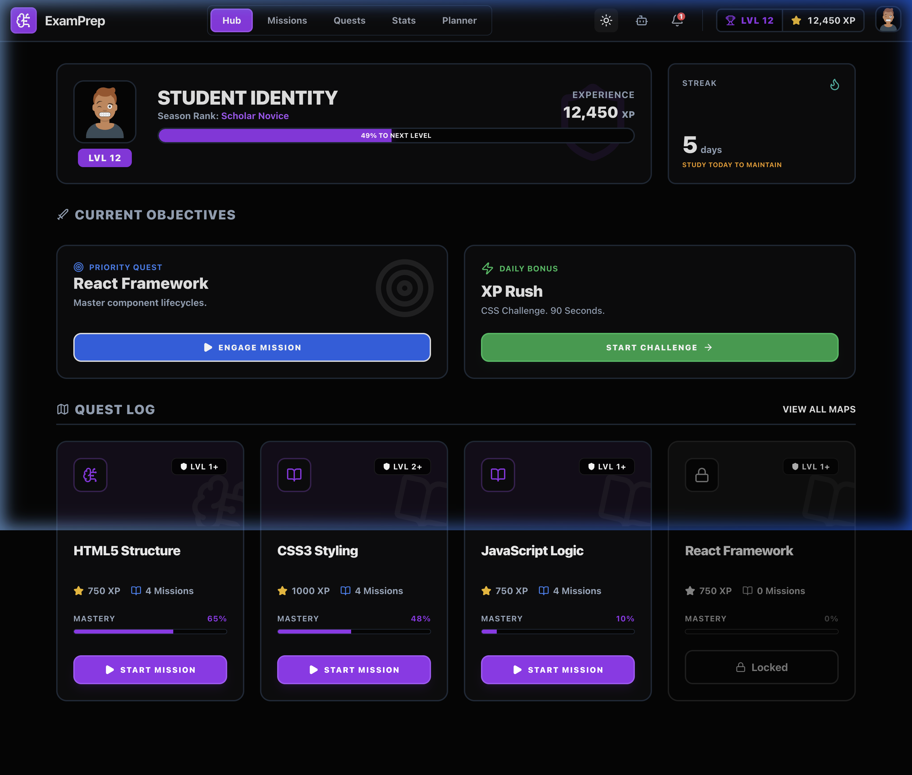

# EduPulse: Cloud-Native Academic Intelligence Platform



## Overview
EduPulse is an Enterprise-Grade, Cloud-Native Academic Intelligence Platform designed to revolutionize educational management, analytics, and student intervention. It moves beyond standard Learning Management Systems (LMS) by integrating real-time analytics, AI-driven placement readiness assessments, and robust risk prediction.

## Core Features
*   **Learning Management Engine:** Adaptive curriculum delivery, assignment tracking, and dynamic course scaling.
*   **Analytics Engine:** Real-time metrics on student engagement, attendance, and overall educational momentum.
*   **Placement Readiness:** AI-driven assessments measuring student preparedness for industry integration.
*   **Risk Prediction & Intervention:** Automated tracking of high-risk students and targeted intervention management.
*   **AI Integration:** Native support for generative AI tutoring and automated assessment grading via the Gemini API.
*   **Enterprise DevOps Automation:** fully automated, zero-downtime deployment pipelines utilizing Kubernetes, Terraform, and HashiCorp Vault.

## Cloud Architecture & DevOps
The platform is built on a highly available, fault-tolerant infrastructure completely codified in Terraform.

*   **Continuous Integration / Continuous Deployment (CI/CD):** Jenkins pipelines automatically build and push Docker images to Amazon ECR, followed by Kubernetes cluster rollout.
*   **Orchestration:** Amazon Elastic Kubernetes Service (EKS) dynamically scales the FastAPI backend and React frontend.
*   **Secrets Management:** HashiCorp Vault sidecar injection ensures zero static secrets exist within the application state or GitHub repository.
*   **Monitoring & Observability:** Prometheus scrapes real-time business and infrastructure metrics, visualized via custom Grafana dashboards. Centralized JSON logging is handled by the ELK Stack (Elasticsearch, Logstash, Kibana).
*   **Disaster Recovery:** Amazon RDS PostgreSQL Multi-AZ failover and encrypted S3 versioning provide an immediate recovery mechanism against localized region degradation or data corruption.

## Quick Start
To run the platform locally via Docker Compose:

```bash
# 1. Clone the repository
git clone https://github.com/ArsheelPatel06/EduPulse.git
cd EduPulse

# 2. Setup Environment Variables
cp .env.example .env

# 3. Build and run the containers
docker compose up -d
```

## Documentation
For complete architectural overviews, database schemas, and deployment instructions, please refer to the Master Documentation:
- [Platform Architecture & Design](docs/platform-architecture.md)
- [AWS Deployment Guide](docs/aws-deployment-guide.md)
- [Disaster Recovery Plan](docs/disaster-recovery.md)
