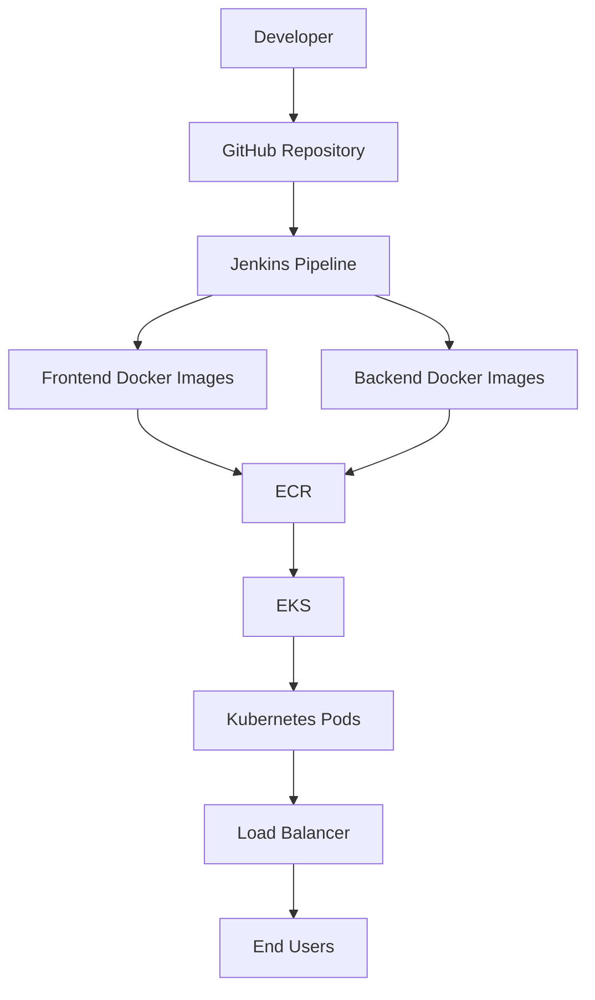

# 3. Deployment Architecture

```mermaid
flowchart TD
    Developer --> GitHubRepository[GitHub Repository]
    GitHubRepository --> JenkinsPipeline[Jenkins Pipeline]
    JenkinsPipeline --> FrontendDockerImages[Frontend Docker Images]
    JenkinsPipeline --> BackendDockerImages[Backend Docker Images]
    FrontendDockerImages --> ECR
    BackendDockerImages --> ECR
    ECR --> EKS
    EKS --> KubernetesPods[Kubernetes Pods]
    KubernetesPods --> LoadBalancer[Load Balancer]
    LoadBalancer --> EndUsers[End Users]
```
