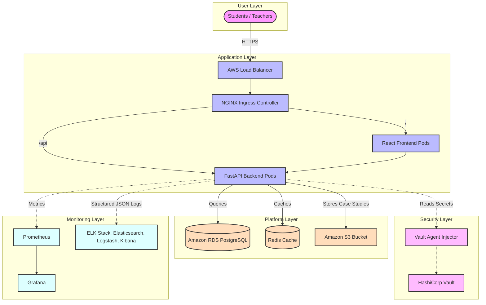

# EduPulse Architecture

```mermaid
flowchart TD
    %% Styling
    classDef userLayer fill:#f9f,stroke:#333,stroke-width:2px;
    classDef appLayer fill:#bbf,stroke:#333,stroke-width:2px;
    classDef platformLayer fill:#bfb,stroke:#333,stroke-width:2px;
    classDef securityLayer fill:#fbf,stroke:#333,stroke-width:2px;
    classDef dataLayer fill:#fdb,stroke:#333,stroke-width:2px;
    classDef monitorLayer fill:#dff,stroke:#333,stroke-width:2px;

    %% User Layer
    subgraph User Layer
        Users([Students / Teachers])
    end

    %% Application Layer
    subgraph Application Layer
        ALB[AWS Load Balancer]
        Ingress[NGINX Ingress Controller]
        Frontend[React Frontend Pods]
        Backend[FastAPI Backend Pods]
    end

    %% Security Layer
    subgraph Security Layer
        Vault[HashiCorp Vault]
        VaultInjector[Vault Agent Injector]
    end

    %% Data / Platform Layer
    subgraph Platform Layer
        RDS[(Amazon RDS PostgreSQL)]
        Redis[(Redis Cache)]
        S3[Amazon S3 Bucket]
    end

    %% Monitoring Layer
    subgraph Monitoring Layer
        Prometheus[Prometheus]
        Grafana[Grafana]
        ELK[ELK Stack: Elasticsearch, Logstash, Kibana]
    end

    %% Connections
    Users -->|HTTPS| ALB
    ALB --> Ingress
    Ingress -->|/api| Backend
    Ingress -->|/| Frontend
    Frontend --> Backend

    Backend -.->|Reads Secrets| VaultInjector
    VaultInjector -.-> Vault

    Backend -->|Queries| RDS
    Backend -->|Caches| Redis
    Backend -->|Stores Case Studies| S3

    Backend -.->|Metrics| Prometheus
    Prometheus --> Grafana
    
    Backend -.->|Structured JSON Logs| ELK

    %% Apply Styles
    class Users userLayer;
    class ALB,Ingress,Frontend,Backend appLayer;
    class RDS,Redis,S3 dataLayer;
    class Vault,VaultInjector securityLayer;
    class Prometheus,Grafana,ELK monitorLayer;
```
