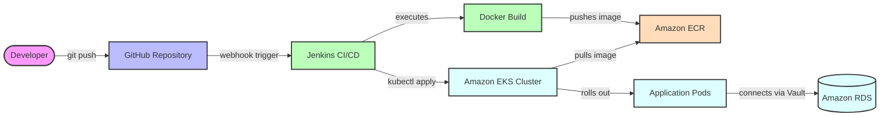

# Deployment Pipeline

```mermaid
flowchart LR
    %% Styling
    classDef developer fill:#f9f,stroke:#333,stroke-width:2px;
    classDef vcs fill:#bbf,stroke:#333,stroke-width:2px;
    classDef ci fill:#bfb,stroke:#333,stroke-width:2px;
    classDef registry fill:#fdb,stroke:#333,stroke-width:2px;
    classDef cluster fill:#dff,stroke:#333,stroke-width:2px;

    Developer([Developer])
    GitHub[GitHub Repository]
    Jenkins[Jenkins CI/CD]
    Docker[Docker Build]
    ECR[Amazon ECR]
    EKS[Amazon EKS Cluster]
    Pods[Application Pods]
    RDS[(Amazon RDS)]

    Developer -->|git push| GitHub
    GitHub -->|webhook trigger| Jenkins
    Jenkins -->|executes| Docker
    Docker -->|pushes image| ECR
    Jenkins -->|kubectl apply| EKS
    EKS -->|pulls image| ECR
    EKS -->|rolls out| Pods
    Pods -->|connects via Vault| RDS

    class Developer developer;
    class GitHub vcs;
    class Jenkins,Docker ci;
    class ECR registry;
    class EKS,Pods,RDS cluster;
```
