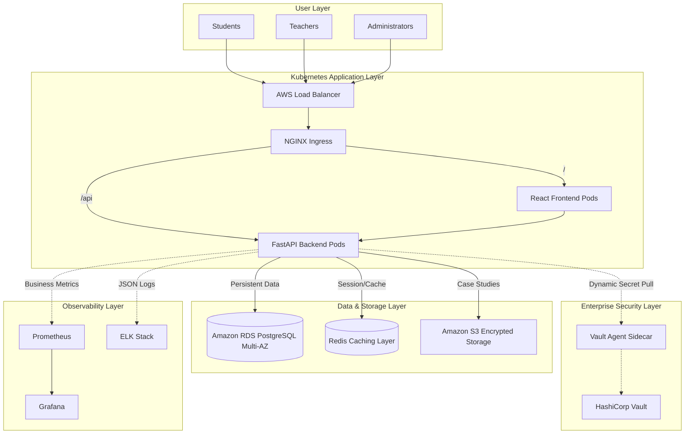
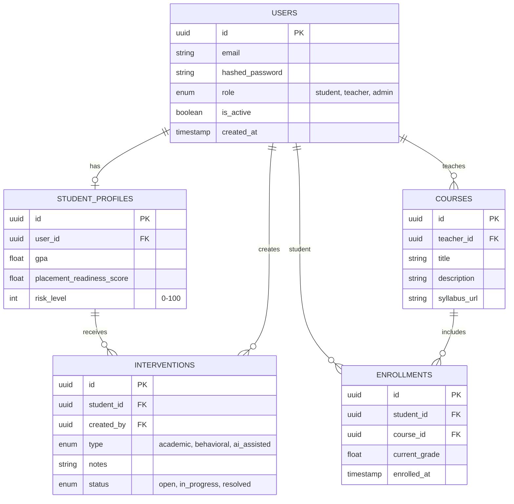

# EduPulse: Enterprise Platform Architecture

This document provides a comprehensive technical breakdown of the EduPulse Academic Intelligence Platform.

## 1. Cloud Infrastructure Architecture

EduPulse relies on a deeply modular, high-availability AWS environment managed entirely via Terraform Infrastructure-as-Code.

## 2. Database Design (PostgreSQL)

The platform utilizes a structured relational database model designed to track student momentum, course progression, and targeted interventions.

## 3. CI/CD & Deployment Strategy

Our DevOps philosophy relies on zero manual intervention beyond the initial Terraform `apply`. 

1. **Version Control:** All code lives in GitHub.
2. **Continuous Integration (Jenkins):** Upon a commit to `main`, Jenkins triggers an automated pipeline that lints the code, builds the `edupulse-frontend` and `edupulse-backend` Docker containers, and pushes them to Amazon ECR.
3. **Continuous Deployment (Kubernetes):** Jenkins updates the Kubernetes deployment manifests and executes a rolling update across the EKS cluster.
4. **Zero-Downtime:** The Kubernetes Horizontal Pod Autoscaler (HPA) ensures that new replica sets are scaled up and health-checked via Prometheus before terminating the old pods.

## 4. Security Posture

- **No Hardcoded Secrets:** We utilize HashiCorp Vault. K8s pods launch with a Vault Agent sidecar that authenticates via a strict IAM role. It fetches secrets (Database Passwords, AI API Keys) and injects them directly into memory (`/vault/secrets/`). They never touch the disk.
- **Network Isolation:** RDS and Vault reside in private VPC subnets. They cannot be routed from the public internet. All traffic must pass through the NGINX Ingress Controller.
- **Encryption:** All S3 buckets enforce `AES256` Server-Side Encryption. RDS utilizes AWS KMS for storage encryption at rest.
